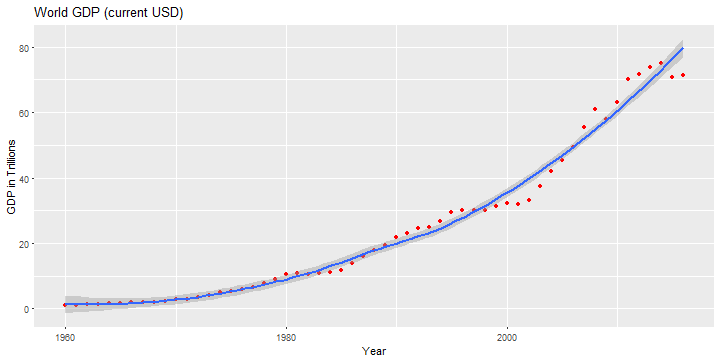
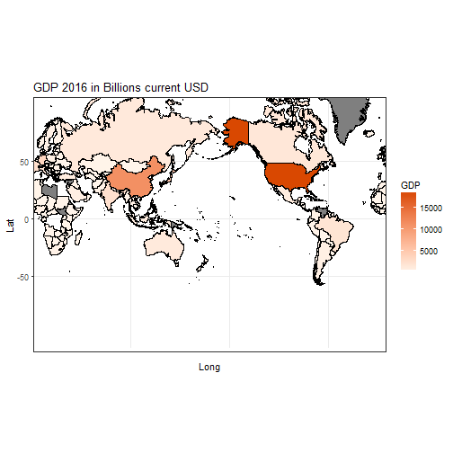
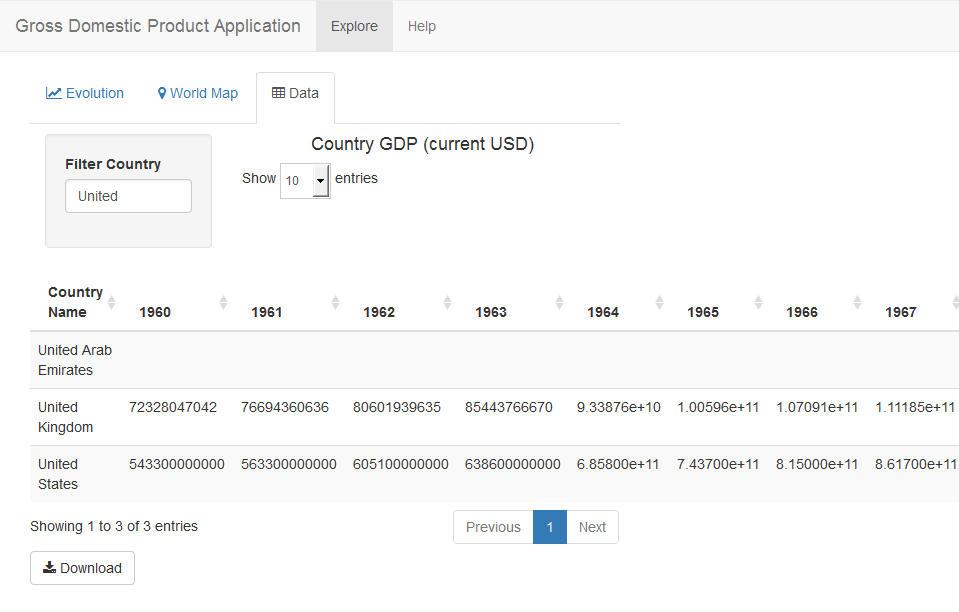

Gross Domestic Product Application
========================================================
author: Javier Carrasco
date: September 10, 2017

Features
========================================================
- World GDP evolution chart (1960-2016).

- World Map for selected year.

- Browse GDP database, optionally filtering by country name, and download data.

World GDP Evolution
=======================================================
During 1960-2016 the World GDP in current USD multiplied by 62.

GDP World Map in 2016
========================================================

GDP Database Browsing
========================================================

